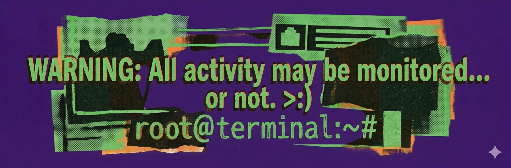

<h1>Hello, I'm Javier</h1>

<h2>About Me</h2>

<h2>Cybersecurity Projects & Skills</h2>
<table>
  <tr>
    <th>Project</th>
    <th>Skills</th>
  </tr>
  <tr>
    <td>
      <a target="_blank" href="https://medium.com/@jje.uribe/letsdefend-http-basic-auth-walkthrough-7cbdf7e0293e">Investigating HTTP Basic Auth with Wireshark</a>
    </td>
    <td>Network Traffic Analysis, Packet Inspection, HTTP Authentication, Wireshark.</td>
  </tr>
  <tr>
    <td>
      <a target="_blank" href="https://medium.com/@jje.uribe/letsdefend-investigate-web-attack-walkthrough-a53773f43c10">Tracing a Web Attack: Automated Scanning, Command Injection, and Persistence</a>
    </td>
    <td>Threat Detection, Incident Investigation, Web Exploitation, Manual Log Review & Anomaly Detection.</td>
  </tr>
  <tr>
    <td>
      <a target="_blank" href="https://medium.com/@jje.uribe/letsdefend-brute-force-attack-walkthrough-1ba13a40b116">Uncovering a Brute-force Attack with Wireshark</a>
    </td>
    <td>Network Traffic Analysis, Packet Inspection, SSH Log Analysis, RDP Traffic Analysis, CSV/text export + shell parsing (grep/cut/sort/wc), MITRE ATT&CK mapping, Wireshark.</td>
  </tr>
  <tr>
    <td>
      <a target="_blank" href="https://medium.com/@jje.uribe/letsdefend-port-scan-activity-walkthrough-65d75e16d3fc">Port Scan Detection and Host Fingerprinting Investigation
      </a>
    </td>
    <td>TCP flag inspection, Recognizing Scan Behavior Patterns, Spotting Anomalous Traffic volumes, MAC OUI/vendor resolution, Passive OS Fingerprinting (TTL & TCP window heuristics), Wireshark.</td>
  </tr>
  <tr>
    <td>
      <a target="_blank" href="https://medium.com/@jje.uribe/hackthebox-windows-event-logs-and-finding-evil-skills-assessment-f289d9620f4b">Windows Forensics: Detecting Threat Actor Techniques via Windows Event Logs</a>
    </td>
    <td>Sysmon/Event Viewer Forensics, XPath filtering, Detecting DLL Hijacking, Process Injection & LSASS Credential Dumps, Security-log timeline correlation.</td>
  </tr>
  <tr>
    <td>
      <a target="_blank" href="https://medium.com/@jje.uribe/hackthebox-analyzing-windows-event-logs-en-masse-f418d7c83865">Automating Windows Event-log Analysis with PowerShell</a>
    </td>
    <td>
      PowerShell scripting for forensic automation using Get-WinEvent, Get-ChildItem, Where-Object, and Select-Object, Identifying malicious UNC paths. 
    </td>
  </tr>
</table>

<h2>Articles / Write-ups</h2>

<ul>
  <li><a target="_blank" href="https://medium.com/@jje.uribe/getting-to-know-aws-2ed080849ac9">Cloud Practitioner Essentials — Getting to know AWS</a></li>
  <li><a target="_blank" href="https://medium.com/@jje.uribe/cloud-practitioner-essentials-understanding-computing-in-the-cloud-646d8d02ad61">Cloud Practitioner Essentials — Understanding Computing in the Cloud</a></li>
  <li><a target="_blank" href="https://medium.com/@jje.uribe/cloud-practitioner-essentials-networking-70639c23d8a6">Cloud Practitioner Essentials — Network</a></li>
  <li><a target="_blank" href="https://medium.com/@jje.uribe/hackthebox-introduction-to-windows-command-line-skill-assessment-walkthrough-daa57d6e716d">HackTheBox — Introduction to Windows Command Line, Skill Assessment Walkthrough</a></li>
  <li><a target="_blank" href="https://medium.com/@jje.uribe/cooking-the-proxy-what-the-heck-is-a-proxy-server-e180078ba183">Cooking the Proxy — What the heck is a Proxy Server</a></li>
  <li><a target="_blank" href="https://medium.com/@jje.uribe/understanding-delta-time-in-wireshark-058e49aabf80">Understanding Delta Time in Wireshark</a></li>
</ul>

<h2>Certifications</h2>

<!--
**jjeuribe/jjeuribe** is a ✨ _special_ ✨ repository because its `README.md` (this file) appears on your GitHub profile.

Here are some ideas to get you started:

- 🔭 I’m currently working on ...
- 🌱 I’m currently learning ...
- 👯 I’m looking to collaborate on ...
- 🤔 I’m looking for help with ...
- 💬 Ask me about ...
- 📫 How to reach me: ...
- 😄 Pronouns: ...
- ⚡ Fun fact: ...
-->
